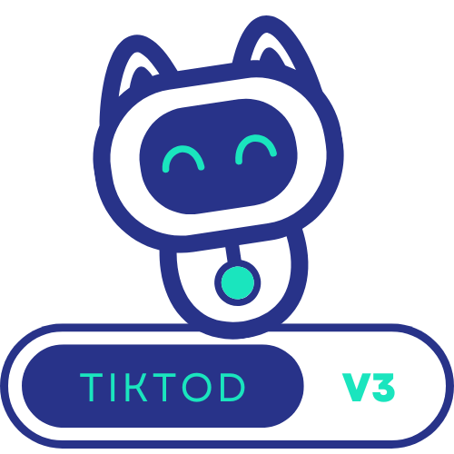

<p align="center">
  
</p>

# TIKTOD V3

TIKTOD V3 is a Windows desktop utility that coordinates selected interactions
through Zefoy for a supplied TikTok video URL. It uses CustomTkinter for the UI,
CloakBrowser/Playwright for browser control, and Tesseract OCR for CAPTCHA text.

## Read this before using the application

The application sends the TikTok URL you enter to **Zefoy**, a third-party
service. It also automates interactions that may violate TikTok's or Zefoy's
rules. That can expose an account to restrictions and creates privacy, legal,
and contractual risk.

Use the application only when you are authorized to do so. Never enter account
credentials or private links. The desktop UI requires an explicit acknowledgment
of these facts before Setup can run.

## Features

- Explicit `IDLE → SETTING_UP → READY → RUNNING → STOPPING` lifecycle.
- Automatic discovery of currently available supported modes.
- In-memory CAPTCHA OCR; generated CAPTCHA images are not stored on disk.
- Stable-image CAPTCHA readiness checks that reject loading placeholders.
- Confirmed send counts when the service reports them.
- At-a-glance target progress, percentage, elapsed time, per-mode session counts,
  and total confirmed activity.
- Bounded retry/backoff behavior, explicit rate-limit pauses, and interruptible
  cooldowns.
- Light and dark themes with persisted preference.
- Keyboard-accessible controls, status feedback, and read-only copyable logs.
- Preflight messages for missing OCR or browser dependencies.

## Requirements

- Windows 10 or newer.
- Python **3.10 or newer** when running from source.
- [Tesseract OCR](https://github.com/tesseract-ocr/tesseract/releases/latest)
  installed and available on `PATH`.
- Internet access during Setup and automation.

CloakBrowser downloads and caches its patched Chromium build on first use. The
download is approximately 200 MB and normally lives under `~/.cloakbrowser`.

## Install from source

Use an isolated environment so project dependencies do not conflict with global
packages:

```powershell
git clone https://github.com/kangoka/tiktodv3.git
cd tiktodv3
python -m venv .venv
.\.venv\Scripts\Activate.ps1
python -m pip install --upgrade pip
python -m pip install -r requirements-lock.txt
python app.py
```

## Application workflow

1. Read and accept the authorization and data-use notice.
2. Enter a public TikTok video URL and positive target amount.
3. Select **Setup**. The app checks Tesseract, launches CloakBrowser, solves the
   CAPTCHA, and discovers supported modes.
4. Choose an available mode and select **Start**.
5. Select **Stop** or press Escape to stop safely.

Disabled and unsupported modes are not offered. Counts are updated only after a
send reaches a confirmed cooldown response; if the service does not report the
exact amount, the log clearly labels the fallback as estimated.

## Keyboard shortcuts

| Shortcut | Action |
|---|---|
| `Alt+S` | Setup, Start, or Stop according to current state |
| `Alt+M` | Cycle the available mode |
| `Alt+T` | Toggle light/dark theme |
| `Ctrl+Tab` | Switch between Log and Stats |
| `Ctrl+L` | Focus the TikTok URL field |
| `Ctrl+G` | Open the GitHub repository |
| `Escape` | Stop an active run |

Tab and Shift+Tab also traverse the inputs, primary action, theme control, mode
selector, disclosure acknowledgment, log actions, and GitHub action.

## Local data

The app stores two preferences in `~/.tiktodv3/settings.json`:

- selected theme;
- whether the risk notice was acknowledged.

TikTok URLs, counters, and log output are not intentionally persisted by the
application. Zefoy and the browser/network stack remain separate trust domains.

## Verification

This project intentionally does not use a `tests/` directory. Deterministic,
offline checks live in the root verification command:

```powershell
python verify.py
python verify_gui.py
python -m compileall -q .
ruff check .
ruff format --check .
mypy .
```

These checks do not launch CloakBrowser, solve a live CAPTCHA, or contact Zefoy.
Live compatibility depends on third-party markup and must be validated manually
by an authorized operator.

## Build an executable

From an activated environment, run:

```powershell
.\build.ps1
```

The build produces `dist/tiktodv3.exe`. Tesseract remains an external system
requirement. Release maintainers should sign the executable and publish a SHA-256
checksum.

## Troubleshooting

- **Tesseract unavailable:** install it, add its installation directory to
  `PATH`, restart the terminal, and retry Setup.
- **First Setup takes a long time:** CloakBrowser may be downloading its patched
  Chromium build.
- **No modes available:** the third-party service has no supported mode enabled;
  retry later.
- **Too many requests:** this is a remote rate limit, not a local CAPTCHA or retry
  failure. Keep only one instance running and let the automatic 90-180 second
  pause finish. If it remains active across three checks, the run stops; wait at
  least 15-30 minutes before restarting. VPN/proxy switching can worsen trust and
  is not a reliable or appropriate workaround.
- **Automation stops after three errors:** the circuit breaker prevented an
  infinite retry loop. Copy the log, confirm the service page still works, and
  retry Setup.
- **GUI opens but a release executable fails:** rebuild using the pinned
  dependencies by running `.\build.ps1` from an activated environment.

## Contributing and reporting issues

Run `python verify.py`, Ruff, and compilation before proposing a change. Keep UI
work on the Tk main thread, keep Playwright work on the dedicated bot worker, and
never add live-service calls to offline verification.

Report vulnerabilities privately to the repository maintainer. Do not include
sensitive TikTok URLs or exploit details in public issues.

## License

Licensed under the [Apache License 2.0](LICENSE). Copyright 2025-2026 kangoka
and contributors. Third-party components retain their respective licenses; see
[THIRD_PARTY_NOTICES.md](THIRD_PARTY_NOTICES.md).

## Disclaimer

This software is provided without warranty. Its use may violate third-party
terms or applicable rules. The operator is responsible for authorization,
compliance, accounts, data, and consequences arising from use.
